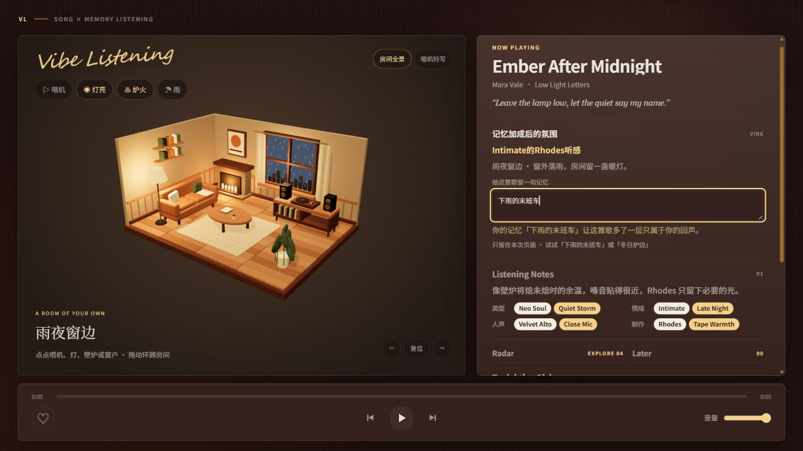

# Vibe Listening

### 给每首歌一个可以待下来的房间。

*A cozy, interactive 3D listening room — shaped by songs and your memories.*

拖动视角，点亮落地灯，让窗外下起雨。写下一句和这首歌有关的记忆，再把时间留给黑胶与炉火。

**Vibe Listening** 是一个运行在桌面浏览器里的沉浸式 R&B 播放器实验，用 Three.js 搭建真实的立体房间，让听歌多一点空间感和参与感。


[快速开始](#快速开始) · [互动玩法](#房间里可以做什么) · [实现细节](docs/3D_ROOM.md) · [反馈想法](https://github.com/HuJohnXuan/vibe-listening/issues)

> 当前为可运行的体验 Demo：10 首虚构曲目，每首提供 6 秒本地合成试听。无需账号、API Key 或后端服务。

## 房间里可以做什么

| 你的动作 | 房间的回应 |
| --- | --- |
| 拖动房间，或使用视角按钮 | 从不同角度看沙发、唱片柜、窗户和壁炉 |
| 点击唱机 | 播放或暂停，唱片与唱臂跟随播放状态 |
| 点击落地灯 | 开关灯光，改变房间的明暗 |
| 点击壁炉 | 开关炉火与暖光 |
| 点击窗户 | 在晴、雨、雪之间切换；“跟随歌曲”恢复自动氛围 |
| 切换“唱机特写” | 靠近黑胶，回到专注的唱机视图 |

房间操作也有可通过键盘访问的按钮。拖动视角不会顺带触发物件开关；WebGL 不可用时自动回退到唱机视图。

## 歌曲 × 记忆

同一首歌，可以属于不同的夜晚。

在歌曲的记忆输入框里试试 **“下雨的末班车”**，或 **“冬日炉边”**。歌曲标签决定基础氛围，记忆里的天气和时间关键词会进一步改变灯光与雨雪。



这里使用本地关键词规则，不调用 AI 模型。记忆按歌曲分别保存在当前页面内存中，切歌后再切回来仍能看到；**刷新清空，不上传，也不写入浏览器存储**。

## 发现下一首

- **Tonight’s Picks**：三首推荐，附上推荐理由。
- **Radar**：沿四条发现路线探索曲目。
- **Later**：把感兴趣的歌放进稍后播放队列，再播放或移除。
- **Listening Notes**：用标签与短评描述听感；支持切歌、进度拖动、音量和喜欢反馈。

推荐采用人工关系优先、标签重合度回退的本地逻辑。

## 快速开始

安装 **Node.js 22.x**，然后运行：

```bash
git clone https://github.com/HuJohnXuan/vibe-listening.git
cd vibe-listening
npm ci
npm run dev
```

打开终端显示的本地地址。无需配置环境变量。

生产构建与本地预览：

```bash
npm run build
npm run start
```

建议使用支持 WebGL 的现代桌面浏览器。当前针对 PC / 笔记本设计，尚未进行移动端重设计。

## 适合拿来做什么

体验一个有空间感的播放器，研究 Three.js 与 React 的互动连接，或以“歌曲 × 记忆”为起点探索自己的音乐产品。

当前尚未接入真实音乐服务、完整歌曲播放或本地音乐导入。演示曲目、歌手、专辑和歌词均为虚构内容；本页图片来自项目实际运行界面。公开在线演示地址尚未确认，可按上面的步骤本地体验。

## 开发与文档

技术栈：**Next.js 16 · React 19 · TypeScript · Three.js**。场景几何在代码中构建，无需下载外部 3D 模型。

```bash
npm test       # 构建 Next.js 并运行 Node 测试
npm run lint
```

| 入口 | 内容 |
| --- | --- |
| [3D 房间](docs/3D_ROOM.md) | 互动机制、渲染策略、参考项目和验收步骤 |
| [架构](docs/ARCHITECTURE.md) | 页面、核心逻辑、服务与适配层 |
| [数据模型](docs/DATA_MODEL.md) | 曲库字段与推荐关系 |
| [测试](docs/TESTING.md) | 覆盖范围与检查方式 |
| [未来 API](docs/FUTURE_API.md) | 外部服务的接入边界 |
| [变更日志](CHANGELOG.md) | 已完成的迭代 |

主要代码在 `src/ui/player/`（播放器与房间）、`src/core/`（状态与推荐）、`src/adapters/local_data/`（演示曲库）；样式位于 `app/globals.css`。

## 一起把房间变得更好

如果你也喜欢这种听歌方式，欢迎点一个 **Star**，方便下次找到这个房间。

欢迎通过 [Issue](https://github.com/HuJohnXuan/vibe-listening/issues) 分享想要的房间互动、使用体验或问题，也欢迎提交 PR。较大的功能建议先描述使用场景；Bug 反馈请附浏览器、窗口尺寸和复现步骤。

感谢 [Three.js](https://github.com/mrdoob/three.js) 提供渲染基础，以及 [cozy-room-3d](https://github.com/hugozap/cozy-room-3d) 带来的空间构成灵感。参考与采用范围见 [3D 房间文档](docs/3D_ROOM.md)。
